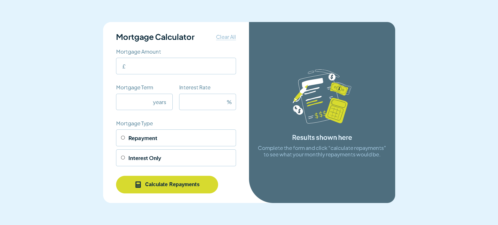
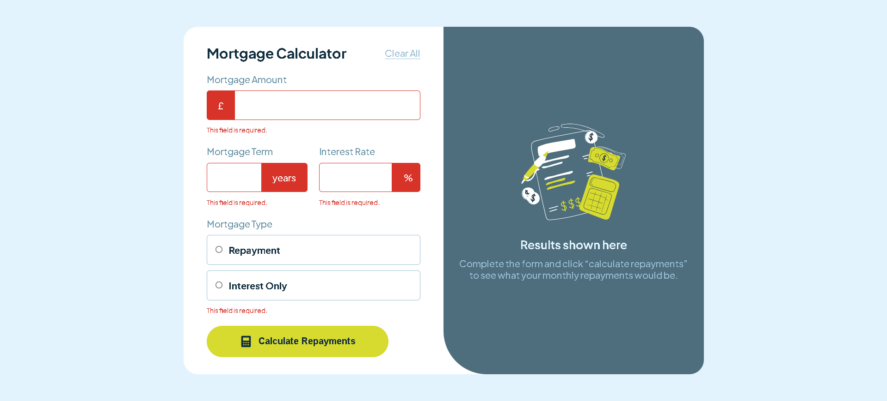
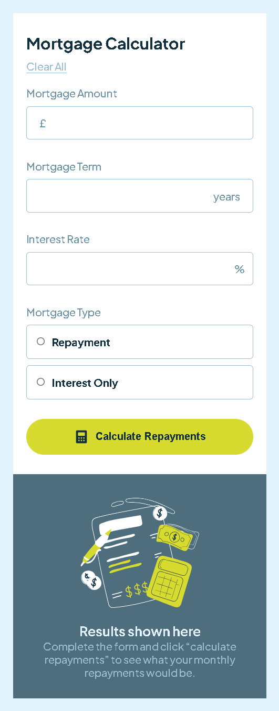
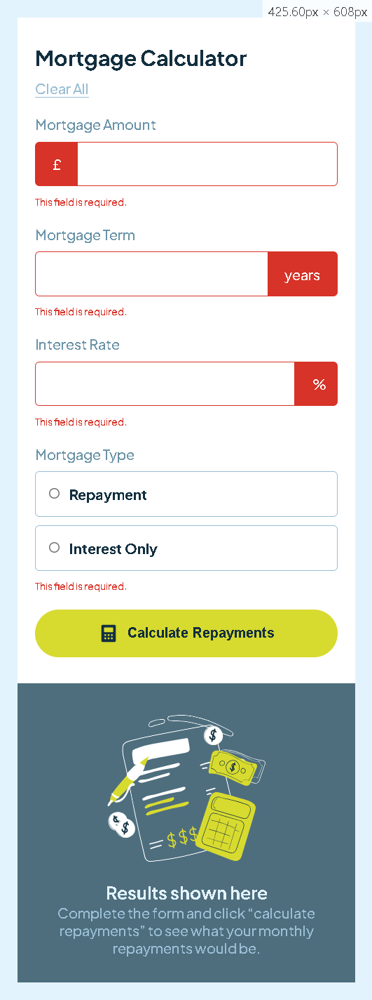

# Frontend Mentor - Mortgage repayment calculator solution

This is a solution to the [Mortgage Repayment Calculator challenge on Frontend Mentor](https://www.frontendmentor.io/challenges/mortgage-repayment-calculator-Galx1LXK73).

## Table of Contents

- [Overview](#overview)
  - [The Challenge](#the-challenge)
  - [Screenshot](#screenshot)
  - [Links](#links)
- [My Process](#my-process)
  - [Built With](#built-with)
  - [What I Learned](#what-i-learned)
  - [Continued Development](#continued-development)
- [Author](#author)

## Overview

### The Challenge

Users should be able to:

- Enter mortgage details (loan amount, interest rate, loan term, mortgage type) and view calculated monthly and total repayments.
- Select whether the mortgage type is 'Repayment' or 'Interest Only'.
- See a summary of their calculated repayments after submitting the form.
- Receive form validation messages if:
    - A required field has been missed
- Clear the form and revert to the empty state.
- View the optimal layout for the interface depending on their device's screen size.
- See hover and focus states for all interactive elements on the page.

### Screenshot

 

### Links

- Solution URL: [GitHub Repository](https://github.com/ffozdemir/mortgage-repayment-calculator) <!-- Updated Repo Link -->
- Live Site URL: [Live Demo](https://superb-stardust-2a48dd.netlify.app) <!-- Replace with your actual live site URL -->

## My process

### Built with

- Semantic HTML5 markup
- CSS custom properties
- Flexbox
- CSS Grid
- Mobile-first workflow
- Vanilla JavaScript

### What I learned

This project was a great exercise in handling form inputs, performing calculations, and updating the DOM with vanilla JavaScript. Implementing the specific mortgage calculation formulas for both 'Repayment' and 'Interest Only' types required careful attention to detail. I also focused on:
- DOM manipulation for displaying results and error messages dynamically.
- Handling user interactions like form submission and reset.
- Implementing input validation to ensure data integrity before calculation.
- Styling interactive elements and ensuring responsiveness across different screen sizes using CSS Flexbox and Grid.

### Continued development

In the future, I might consider:
- Adding more sophisticated input validation (e.g., maximum/minimum values).
- Implementing visual feedback during calculation (e.g., a loading spinner).
- Adding features like an amortization schedule visualization.
- Refactoring the JavaScript code for better organization, perhaps using modules.

## Author

- Frontend Mentor - [@ffozdemir](https://www.frontendmentor.io/profile/ffozdemir)
- GitHub - [@ffozdemir](https://github.com/ffozdemir)